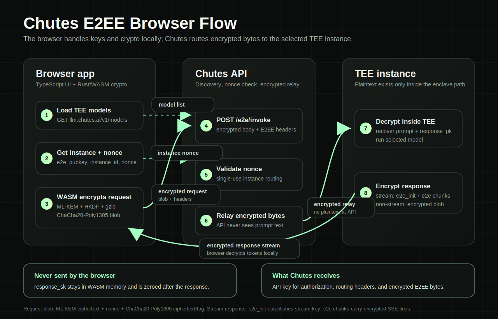

# Chutes E2EE Browser Test

Small browser-native E2EE test client for Chutes. The UI is TypeScript/Vite; the protocol crypto lives in Rust/WASM.



See [SECURITY.md](SECURITY.md) for the browser trust model, deployment checks, and hardening notes.

Requires Node 24. Source WASM compilation also needs a stable Rust toolchain with `wasm32-unknown-unknown`.

## Run

```bash
npm install
npm run wasm
npm run dev
```

Open the Vite URL, paste a Chutes API key, choose a model, and send a prompt.
The key is kept in the input only; it is not stored in localStorage/sessionStorage or committed anywhere.

## Performance

The app only uses speedups that preserve the E2EE protocol boundary:

- `index.html` preconnects to `https://api.chutes.ai` and `https://llm.chutes.ai`, with `dns-prefetch` fallback, so cold DNS/TCP/TLS setup can start before the first API call.
- WASM initializes on page load, before the user sends a prompt.
- Model selection drives E2EE discovery. The app warms only the selected model's `chute_id`.
- Warmed instance public keys and one-time nonces stay in memory, are scoped to `SHA-256(apiKey) + chute_id`, and expire according to Chutes' discovery TTL.
- Each nonce is consumed once. After a successful invoke, the app quietly warms the next nonce for that same key/model pair.
- Streaming responses are decrypted incrementally: each complete encrypted SSE line is authenticated and decrypted as soon as it arrives, then appended to the UI.

## Security And E2EE

This is a browser client, so the browser is trusted for its own plaintext. Within that boundary, the app keeps the E2EE flow strict:

- API keys are never written to `localStorage`, `sessionStorage`, cookies, URLs, or logs.
- Fetches use `credentials: "omit"`.
- Prompt encryption happens only after Send. The app does not pre-encrypt prompts or cache plaintext request bodies.
- Every request gets a fresh response keypair from WASM. Response keys and encrypted request buffers are zeroed after use where JavaScript/WASM exposes writable buffers.
- Nonces are model-specific, key-specific, one-time values. If Chutes rejects a nonce, the app drops the warmed data for that key/model pair and retries once with fresh discovery.
- Precompiled WASM is a portability and deployment choice, not a secrecy boundary. DevTools can inspect WASM, and plaintext necessarily exists in browser memory while being entered or displayed.
- Production uses a restrictive CSP, Trusted Types, `no-referrer`, `nosniff`, frame denial, and a narrow permissions policy. See [SECURITY.md](SECURITY.md).

## WASM Mode

By default, `npm run wasm` compiles the Rust crypto source with `wasm-pack`.
For deploy or browser-only testing, set `E2EE_PRECOMPILED_WASM=1` to use the checked-in artifacts in `src/wasm/` instead:

```bash
E2EE_PRECOMPILED_WASM=1 npm run build
```

The helper script is also available directly:

```bash
npm run wasm:precompiled
npm run build:precompiled
```

CI tests precompiled mode from a clean checkout before rebuilding from Rust source. The Rust toolchain is pinned in `rust-toolchain.toml`; source builds can still produce different WASM bytes across host triples, so deployment uses the committed precompiled artifact.

This flag only controls whether the build re-compiles Rust or ships the checked-in WASM. It is not a browser secrecy boundary: DevTools can download and disassemble WASM, and the browser still owns the runtime, plaintext inputs, API key, and decrypted outputs.

## Check

```bash
cargo test --manifest-path wasm/Cargo.toml
cargo clippy --manifest-path wasm/Cargo.toml --all-targets -- -D warnings
npm run check:precompiled
npm run build:precompiled
npm run check
npm run build
npm audit --audit-level=high
```

CI runs the same deterministic checks on every push and pull request. A live Chutes smoke test runs on pushes and manual workflow runs when the `CHUTES_TEST_API_KEY` GitHub secret is configured. Use a scoped, low-quota key for that secret.

This app needs Chutes CORS to allow `https://chutes-e2ee-test.onrender.com` on:

- `GET /e2e/instances/*`
- `POST /e2e/invoke`
- request headers: `Authorization`, `Content-Type`, `X-Chute-Id`, `X-Instance-Id`, `X-E2E-Nonce`, `X-E2E-Stream`, `X-E2E-Path`

`render.yaml` deploys this as the `chutes-e2ee-test` static site and sets the production security headers.
